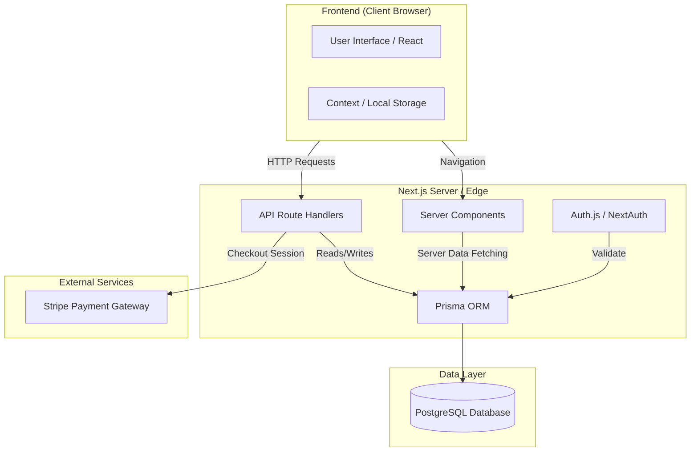

# Modern Esthete - Architecture Documentation

## System Overview
Modern Esthete is a high-end e-commerce platform built with Next.js 15, focusing on performance, SEO, and visual aesthetics. The system architecture leverages modern serverless patterns (Vercel) and a robust relational database (PostgreSQL).

## Tech Stack
- **Frontend**: Next.js 15 (App Router), React 19, TailwindCSS 4
- **Backend**: Next.js Route Handlers (Serverless/Edge compatible)
- **Database**: PostgreSQL (via Prisma ORM)
- **Authentication**: Auth.js (NextAuth v5 beta)
- **Payments**: Stripe (Planned)

## Architecture Diagram

## Data Model (Prisma)
The database schema (`schema.prisma`) is designed for scalability and data integrity.

### Core Models
- **User**: Authentication and profile data. Linked to `Orders` and `Addresses`.
- **Product**: Core catalog item. Includes `slug` for SEO-friendly URLs, `images` array, and `stock` management.
- **Category**: Hierarchical organization (supports subcategories).
- **Order**: Transactional record linking `User`, `Address`, and `OrderItems`.
- **Cart**: Persistent shopping cart (optional/hybrid approach).

## Authentication Flow
1. **Sign Up**: `/api/auth/register` hashes password (bcrypt) and creates `User`.
2. **Login**: Credentials provider validates hash against DB.
3. **Session**: JWT-based stateless session handling for Edge compatibility.
4. **Middleware**: Protects routes (e.g., `/account`) based on session token.

## API Design
RESTful endpoints following Next.js standard conventions:
- `GET /api/products`: List products (pagination supported).
- `POST /api/cart`: Sync local cart to server.
- `POST /api/auth/register`: User creation.
