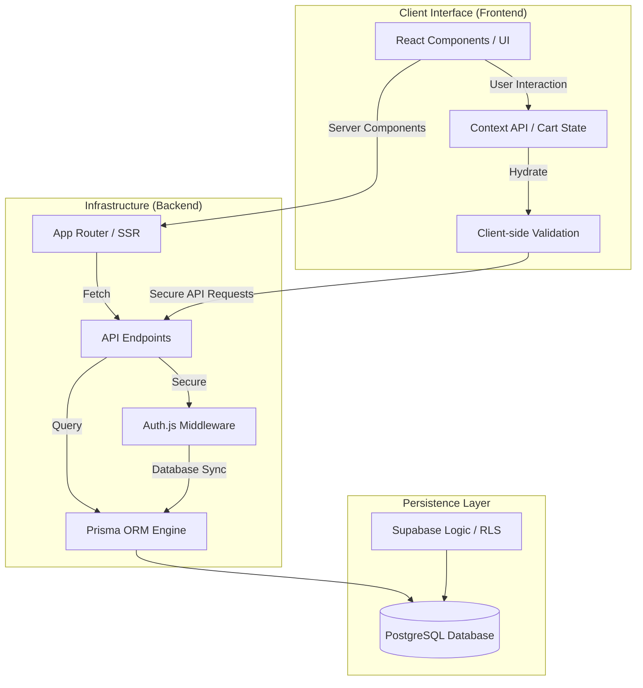

# Modern Esthete

<p align="center">
  
</p>

Modern Esthete is a premium, high-performance e-commerce platform built with **Next.js 15**, **Auth.js v5**, **Prisma**, and **Supabase**. It features a "Modern Minimalist" aesthetic with a core focus on typography, editorial layouts, and a seamless shopping experience.

---

## 🛠️ Tech Stack


- [**Next.js 15**](https://nextjs.org/): Core framework for both frontend UI and backend API routes.
- [**Supabase**](https://supabase.com/): Managed PostgreSQL database with real-time capabilities and security.
- [**Tailwind CSS 4.0**](https://tailwindcss.com/): Modern styling engine for high-end minimalist aesthetics.
- [**Prisma**](https://www.prisma.io/): Type-safe ORM for database modeling and efficient querying.
- [**Auth.js v5**](https://authjs.dev/): Flexible authentication for the Next.js ecosystem.

---

## 🏗️ Project Architecture

The platform follows a modern full-stack architecture, utilizing Next.js as the bridge between user experience and data persistence.



---

## 📊 Data Model (Prisma Schema)

The architecture prioritizes relational integrity through a structured schema:

- **User**: Central identity node.
- **Product**: Catalog management with SEO-optimized slugs.
- **Order/OrderItem**: Transactional records with relational mapping.
- **Cart**: Session-persistent state management.
- **Cascading Logic**: Configured at the DB level to ensure data hygiene upon user deletion.

---

## 🔐 Security & Hardening

- **RLS (Row Level Security)**: Supabase policies ensure that users can only access their own transactional data (`auth.uid()`).
- **Middleware Validation**: Next.js middleware intercepts requests to verify identity via Auth.js before reaching data-sensitive routes.
- **Encryption**: sensitive data is handled using `bcryptjs` for secure hashing.

---

## 🚀 Deployment & Initialization

### 1. Database Sync
```bash
npx prisma generate
npx prisma db push
```

### 2. Environment Variables
Required keys: `DATABASE_URL`, `DIRECT_URL`, `AUTH_SECRET`, `SUPABASE_SERVICE_ROLE_KEY`.

## 🤝 Contributing

Developed with ❤️ for the Tech Community.

---

## 📜 Licencia

Este proyecto está bajo la licencia MIT. Puedes usarlo libremente, siempre citando al autor.