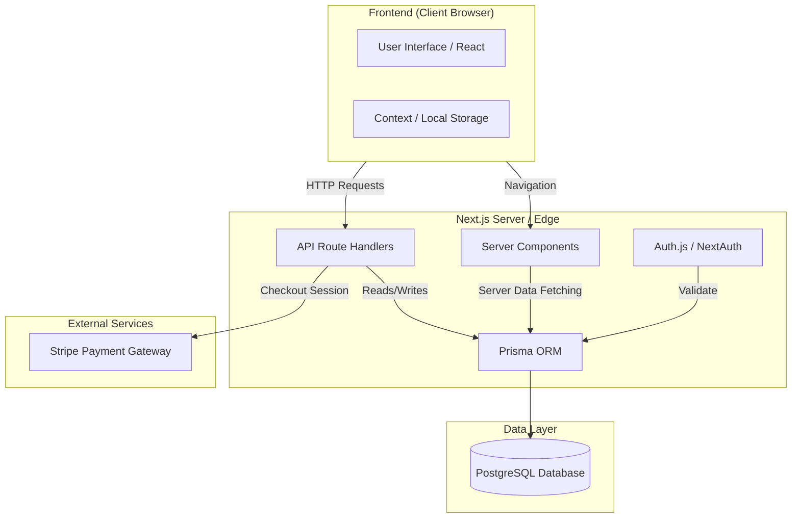

# Modern Esthete

<p align="center">
  
</p>

Modern Esthete is a premium, high-performance e-commerce platform built with **Next.js 15**, **Auth.js v5**, **Prisma**, and **Supabase**. It features a "Modern Minimalist" aesthetic with a core focus on typography, editorial layouts, and a seamless shopping experience.

## 🛠️ Tech Stack

- **Framework**: [Next.js 15](https://nextjs.org/) (App Router)
- **Authentication**: [Auth.js v5](https://authjs.dev/) (NextAuth) - Credentials & JWT
- **Database**: [Supabase](https://supabase.com/) (PostgreSQL)
- **ORM**: [Prisma](https://www.prisma.io/)
- **Styling**: [Tailwind CSS 4](https://tailwindcss.com/)
- **State Management**: React Context API (Cart Logic)
- **Icons**: [Lucide React](https://lucide.dev/)
- **Fonts**: Manrope (Google Fonts)

## 📂 Project Structure

```bash
Modern Esthete/
├── prisma/                  # Database schema & migrations
│   └── schema.prisma        # Prisma Data Model (User, Product, Order, etc.)
├── public/                  # Static assets (images, fonts, etc.)
├── src/
│   ├── app/                 # Next.js App Router (Pages & API)
│   │   ├── (auth)/          # Authentication Routes
│   │   │   ├── login/       # Redesigned Login Page
│   │   │   └── register/    # Redesigned Register Page
│   │   ├── account/         # Protected User Profile Page
│   │   ├── api/             # Backend API Endpoints
│   │   │   ├── auth/        # Auth.js Handlers
│   │   │   ├── products/    # Product Management
│   │   │   └── cart/        # Cart Persistence
│   │   ├── cart/            # Checkout & Cart UI
│   │   ├── shop/            # Catalog and Product Details
│   │   ├── layout.tsx       # Root layout with Navbar/Footer
│   │   └── page.tsx         # High-impact Home Page
│   ├── components/          # Reusable UI Architecture
│   │   ├── Navbar.tsx       # Dynamic navigation with Auth state
│   │   ├── Hero.tsx         # Modern landing hero
│   │   └── ...              # Other core components
│   ├── context/             # Global Logic
│   │   └── CartContext.tsx  # Shopping cart state & local storage
│   ├── lib/                 # Core utilities
│   │   └── prisma.ts        # Singleton Prisma client
│   ├── auth.ts              # Auth.js Configuration
│   └── globals.css          # Design system & Tailwind config
├── .env                     # Environment Variables (Secrets)
├── architecture.drawio      # Visual architecture diagram
├── security_policies.sql    # Supabase RLS policies
└── package.json             # Dependencies & Scripts
```

## 🏗️ System Architecture

Modern Esthete leverages modern serverless patterns and a robust relational database.

### Architecture Diagram



## 📊 Data Model (Prisma)

The database schema is designed for scalability and data integrity.

- **User**: Authentication and profile data. Linked to `Orders` and `Addresses`.
- **Product**: Core catalog item. Includes `slug` for SEO-friendly URLs.
- **Category**: Hierarchical organization.
- **Order**: Transactional record linking `User`, `Address`, and `OrderItems`.
- **Cart**: Persistent shopping cart management.

## 🔐 Security (RLS)

The database is hardened using **Row Level Security (RLS)** in Supabase.
- Public tables (`Product`, `Category`) are read-only for all.
- Private tables (`User`, `Order`, `Cart`) are restricted to the owner (`auth.uid()`).
- Use the provided `security_policies.sql` to apply these rules.

## 🚀 Getting Started

### 1. Requirements
- Node.js 20+
- A Supabase project (PostgreSQL)

### 2. Installation
```bash
npm install
```

### 3. Environment Setup
Configure your `.env` with `DATABASE_URL`, `DIRECT_URL`, and `AUTH_SECRET`.

### 4. Database Sync
```bash
npx prisma generate
npx prisma db push
```

### 5. Run Development
```bash
npm run dev
```

## 📄 License
Private Repository - Modern Esthete Team.
