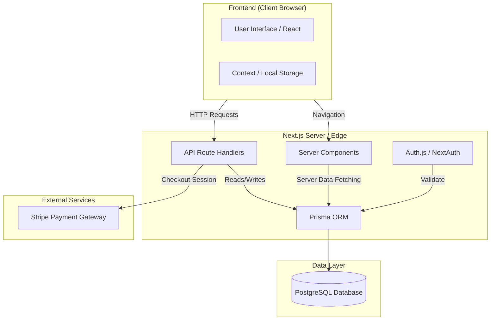

# Modern Esthete

<p align="center">
  
</p>

Modern Esthete is a premium, high-performance e-commerce platform built with **Next.js 15**, **Auth.js v5**, **Prisma**, and **Supabase**. It features a "Modern Minimalist" aesthetic with a core focus on typography, editorial layouts, and a seamless shopping experience.

---

## 🛠️ Tech Stack

- **Framework**: [Next.js 15](https://nextjs.org/) (App Router)
- **Authentication**: [Auth.js v5](https://authjs.dev/) (NextAuth) - Credentials & JWT
- **Database**: [Supabase](https://supabase.com/) (PostgreSQL)
- **ORM**: [Prisma](https://www.prisma.io/)
- **Styling**: [Tailwind CSS 4](https://tailwindcss.com/)
- **State Management**: React Context API (Cart Logic)
- **Icons**: [Lucide React](https://lucide.dev/)
- **Fonts**: Manrope (Google Fonts)

## 📂 Project Structure

```bash
Modern Esthete/
├── prisma/                  # Database schema & migrations
│   ├── schema.prisma        # Prisma Data Model
│   └── seed.ts              # Database Seeder (Products/Categories)
├── public/                  # Static assets & Logos
├── src/
│   ├── app/                 # Next.js App Router (Pages & API)
│   │   ├── (auth)/          # Auth flows (Login/Register)
│   │   ├── account/         # User Profile
│   │   ├── api/             # Backend Endpoints
│   │   ├── cart/            # Checkout Flow
│   │   ├── shop/            # Catalog Layer
│   │   └── layout.tsx       # Root UI Wrapper
│   ├── components/          # Reusable UI Architecture
│   │   ├── Hero.tsx         # High-impact visuals
│   │   └── Navbar.tsx       # Dynamic Auth Navigation
│   ├── context/             # Global State (Cart)
│   ├── lib/                 # Core utilities (Prisma Client)
│   ├── auth.ts              # NextAuth v5 Config
│   └── globals.css          # Design System
├── .env                     # Secrets (Supabase/Auth)
├── LICENSE                  # MIT License
├── architecture.drawio      # Editable source diagram
├── security_policies.sql    # Database Hardening
└── package.json             # Core Metadata
```

## 🏗️ System Architecture

Modern Esthete leverages modern serverless patterns and a robust relational database.

### Architecture Diagram



## 📊 Data Model (Prisma)

The database schema is designed for scalability and data integrity.

- **User**: Authentication and profile data. Linked to `Orders` and `Addresses`.
- **Product**: Core catalog item. Includes `slug` for SEO-friendly URLs.
- **Category**: Hierarchical organization.
- **Order**: Transactional record linking `User`, `Address`, and `OrderItems`.
- **Cart**: Persistent shopping cart management.

## 🔐 Security (RLS)

The database is hardened using **Row Level Security (RLS)** in Supabase.
- Public tables (`Product`, `Category`) are read-only for all.
- Private tables (`User`, `Order`, `Cart`) are restricted to the owner (`auth.uid()`).
- Use the provided `security_policies.sql` to apply these rules.

---

## 🚀 Getting Started

### 1. Requirements
- Node.js 20+
- A Supabase project (PostgreSQL)

### 2. Installation
```bash
npm install
```

### 3. Environment Setup
Configure your `.env` with `DATABASE_URL`, `DIRECT_URL`, and `AUTH_SECRET`.

### 4. Database Sync
```bash
npx prisma generate
npx prisma db push
```

### 5. Run Development
```bash
npm run dev
```

---

## 📜 Licencia

Este proyecto está bajo la licencia MIT. Puedes usarlo libremente, siempre citando al autor.