# 👒 MODERN_ESTHETE - Backend Systems

---

## 🛠️ Tech Stack

- **Framework**: `Next.js 16` (App Router, Server Actions, Middleware).
- **Styling**: `Tailwind CSS 4.x` with modern design patterns.
- **ORM & DB**: `Prisma v6` + `Supabase` (PostgreSQL) with RLS security.
- **Auth**: `Auth.js v5` (NextAuth Beta) for secure session handling.
- **Validation**: `Zod` for schema-based data integrity.

---

## 🏗️ Backend Architecture

The Modern Esthete backend is designed as a secure, type-safe serverless infrastructure.

```mermaid
graph TD
    %% Global Styles
    classDef client fill:#e1f5fe,stroke:#01579b,stroke-width:2px;
    classDef server fill:#fff3e0,stroke:#e65100,stroke-width:2px;
    classDef security fill:#f3e5f5,stroke:#4a148c,stroke-width:2px;
    classDef database fill:#e8f5e9,stroke:#1b5e20,stroke-width:2px;

    subgraph Client ["🌐 Client Interface (Frontend)"]
        UI["💻 React Components"]
        State["📦 Cart State (Context)"]
        Logic["🛡️ Client Validation"]
    end

    subgraph Server ["⚡ Infrastructure (Backend)"]
        Routes["🚀 App Router / SSR"]
        API["📡 API Endpoints"]
        Auth["🔐 Auth.js Middleware"]
        Prisma["💎 Prisma ORM Engine"]
    end

    subgraph Data ["💾 Persistence Layer"]
        Postgres[(🗄️ PostgreSQL Database)]
        Supabase["🔥 Supabase Logic / RLS"]
    end

    %% Connections
    UI --> State
    State --> Logic
    Logic --> API
    UI --> Routes
    Routes --> API
    API --> Auth
    API --> Prisma
    Auth --> Prisma
    Prisma --> Postgres
    Supabase --> Postgres

    %% Assign Classes
    class UI,State,Logic client;
    class Routes,API server;
    class Auth security;
    class Prisma,Postgres,Supabase database;
```

---

## � Security Model & DB

- **Row Level Security (RLS)**: Direct data protection at the database level.
- **Zod Validation**: Strict validation for all incoming requests.
- **JWT Protection**: Secure, encrypted session tokens.

---

## ⚙️ Environment Configuration

| Variable | Provider | Purpose |
| :--- | :--- | :--- |
| `DATABASE_URL` | PostgreSQL | Main database connection string |
| `DIRECT_URL` | PostgreSQL | Direct connection string for migrations |
| `AUTH_SECRET` | Auth.js | Key for sesión encryption |
| `SUPABASE_SERVICE_ROLE_KEY` | Supabase Admin | Access for user deletion |

## 🤝 Contributing

Developed with ❤️ for the Tech Community.

---

## 📜 Licencia

Este proyecto está bajo la licencia MIT. Puedes usarlo libremente, siempre citando al autor.