# Modern Esthete - Backend Architecture

<p align="center">
  
</p>

Technical documentation overviewing the backend infrastructure, data modeling, and security protocols of the Modern Esthete platform.

---

## 🛠️ Tech Stack


- [**Next.js 15**](https://nextjs.org/): The React framework for the web. Specialized in Server Components, streaming, and high-performance rendering.
- [**Supabase**](https://supabase.com/): Backend-as-a-Service providing PostgreSQL database, Secure Auth, and real-time capabilities.
- [**Tailwind CSS 4.0**](https://tailwindcss.com/): A utility-first CSS framework for rapid UI development with a custom premium design system.
- [**Prisma**](https://www.prisma.io/): Next-generation ORM for Node.js and TypeScript, making database access easy and type-safe.
- [**TypeScript**](https://www.typescriptlang.org/): Static type checking for robust, scalable, and maintainable code.
- [**Auth.js v5**](https://authjs.dev/): Secure authentication and session management designed specifically for the Next.js ecosystem.

---

## 🏗️ Architecture & Logic Flow

The Modern Esthete backend uses a serverless model focused on data integrity.

### Structural Overview

```mermaid
graph TD
    subgraph Client ["Client Layer"]
        UI[Frontend / React]
        AuthC[Auth.js Client]
    end

    subgraph Server ["Backend Layer (Next.js)"]
        API[API Route Handlers]
        AuthS[Auth.js Server/Middleware]
        Prisma[Prisma Client]
        
        API --> |Context| AuthS
        API --> |Data| Prisma
        AuthS --> |Persist| Prisma
    end

    subgraph Data ["Persistence Layer"]
        Postgres[(PostgreSQL)]
        Supabase[Supabase Admin/RLS]
        Prisma --> Postgres
        Supabase --> Postgres
    end

    Client --> |Secure Fetch| API
```


### Process Example: Account Deletion


---

## 📊 Data Model (Prisma Schema)

The architecture prioritizes relational integrity through a structured schema:

- **User**: Central identity node.
- **Product**: Catalog management with SEO-optimized slugs.
- **Order/OrderItem**: Transactional records with relational mapping.
- **Cart**: Session-persistent state management.
- **Cascading Logic**: Configured at the DB level to ensure data hygiene upon user deletion.

---

## 🔐 Security & Hardening

- **RLS (Row Level Security)**: Supabase policies ensure that users can only access their own transactional data (`auth.uid()`).
- **Middleware Validation**: Next.js middleware intercepts requests to verify identity via Auth.js before reaching data-sensitive routes.
- **Encryption**: sensitive data is handled using `bcryptjs` for secure hashing.

---

## 🚀 Deployment & Initialization

### 1. Database Sync
```bash
npx prisma generate
npx prisma db push
```

### 2. Environment Variables
Required keys: `DATABASE_URL`, `DIRECT_URL`, `AUTH_SECRET`, `SUPABASE_SERVICE_ROLE_KEY`.

---

&copy; 2024 MODERN_ESTHETE - Technical Backend Overview.

---

## 📜 Licencia

Este proyecto está bajo la licencia MIT. Puedes usarlo libremente, siempre citando al autor.